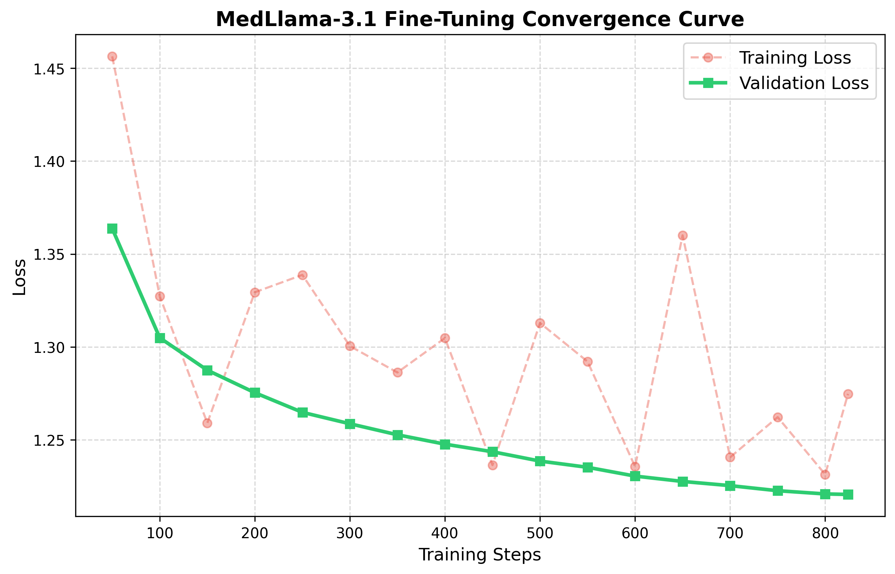

# MedLlama-3.1: Parameter-Efficient Fine-Tuning for Empathetic AI Medical Assistants

This repository contains the end-to-end pipeline for fine-tuning **Llama-3.1-8B-Instruct** into a specialized medical-domain assistant. Leveraging memory-efficient techniques via **Unsloth** (PEFT/LoRA + BitsAndBytes 4-bit quantization), the model was domain-adapted on the **ChatDoctor-iCliniq** dataset to generate empathetic, clinically aligned insights while adhering strictly to medical safety disclaimers.

---

## 🚀 Key Technical Highlights

### Hardware Efficiency
Utilizing **Unsloth**, training was completed rapidly within a single epoch while using up to **60–80% less memory** compared to native Hugging Face SFT pipelines.

### Structured Chat Templates
System prompts and multi-turn clinical chat frameworks were injected globally via **Llama-3.1 tokenizers** to preserve instruction-following stability.

### Rigorous Multi-Metric Evaluation
Implemented an independent evaluation framework comparing the base model and the fine-tuned adapter using both:

- **Lexical Metrics:** BLEU, ROUGE-1, ROUGE-2, ROUGE-L
- **Semantic Metrics:** BERTScore F1

---

## 🛠️ Technologies Used

### Base Architecture
- Meta Llama-3.1-8B-Instruct
- Quantized to 4-bit via BitsAndBytes

### PEFT Framework
- LoRA (Low-Rank Adaptation)
- Unsloth
- PEFT

### Training & Configuration
- Hugging Face TRL
- SFTTrainer (Supervised Fine-Tuning)
- PyTorch

### Dataset
- `lavita/ChatDoctor-iCliniq`
- Patient–Doctor dialogues

### Evaluation Suites
- `rouge-score`
- `nltk` (BLEU)
- `bert-score` (Semantic F1 via GPU)

---

## 📂 Project Structure

```text
.
├── Evaluation Dataset/
│   ├── medical_eval_dataset.json          # Paired evaluations (Base vs. LoRA vs. Ground Truth)
│   └── medical_eval_in_distribution.json  # Processed evaluation samples
├── Notebooks/
│   ├── Training_pipeline.ipynb            # End-to-end SFT training logic with Unsloth
│   └── Evaluation_pipeline.ipynb          # Automated lexical & semantic evaluation suite
└── report/
    └── medllama_loss_curve.png            # Visualized training & validation loss curve
```

---

## 🔬 Detailed Methodology

### 1. Data Preprocessing & Alignment

Raw conversations from **ChatDoctor-iCliniq** were:

- Filtered
- Cleaned of whitespace anomalies
- Mapped into an instruction-following format

Each sample was formatted using the native **Llama-3.1 chat template** syntax with an embedded system persona.

#### System Persona

> You are an expert, professional, and deeply empathetic AI Medical Assistant. Analyze the patient's symptoms carefully, provide potential clinical insights, and suggest immediate precautions. Strictly Disclaimer: This is for informational purposes only, not a substitute for professional medical advice.

---

### 2. Parameter-Efficient Architecture (LoRA)

To optimize training efficiency and target adaptation capacity, LoRA weights were applied to all major transformer projection layers:

- `q_proj`
- `k_proj`
- `v_proj`
- `o_proj`
- `gate_proj`
- `up_proj`
- `down_proj`

#### Configuration

| Parameter | Value |
|------------|--------|
| Rank (`r`) | 16 |
| LoRA Alpha (`α`) | 32 |
| Dropout | 0 |
| Quantization | BitsAndBytes 4-bit NF4 |

---

### 3. Hyperparameters for Supervised Fine-Tuning (SFT)

| Hyperparameter | Value |
|----------------|--------|
| Batch Size | 2 per device |
| Gradient Accumulation Steps | 4 |
| Effective Batch Size | 8 |
| Learning Rate | `2 × 10⁻⁴` |
| Scheduler | Linear |
| Warmup Steps | 50 |
| Optimizer | `adamw_8bit` |
| Precision | bf16 (if supported), otherwise fp16 |

---

## 📊 Results & Convergence Curve

### 1. Convergence Behavior

Training converged smoothly within **1 epoch (~825 steps)** without signs of catastrophic forgetting or severe overfitting.

<p align="center"></p>

Key observations:

- Training loss decreased consistently.
- Validation loss closely tracked training loss.
- Final validation loss stabilized around **1.22**.

---

### 2. Paired Benchmark Performance

A held-out test set of **100 in-distribution samples** was used to compare the base model against the fine-tuned LoRA adapter.

| Metric | Base Model | Fine-Tuned LoRA | Improvement (Δ) |
|----------|------------|-----------------|----------------|
| ROUGE-1 | 0.2240 | 0.3410 | +52.2% |
| ROUGE-2 | 0.0298 | 0.0926 | +210.7% |
| ROUGE-L | 0.1183 | 0.2041 | +72.5% |
| BLEU | 0.0060 | 0.0431 | +618.3% |
| BERTScore (F1) | 0.8360 | 0.8613 | +3.0% |

---

## 🔍 Key Metrics Analysis

### Lexical Alignment

The substantial gains in:

- BLEU (+618%)
- ROUGE-2 (+210%)

suggest that the model successfully learned specialized medical vocabulary, terminology, and response structures commonly used in professional healthcare communication.

### Semantic Robustness

The increase in BERTScore:

```text
0.8360 → 0.8613
```

indicates that the model improved beyond simple phrase memorization, achieving stronger semantic alignment and more clinically relevant responses compared to the base instruction-tuned model.

---

## 🔮 Future Work

### Clinical Safety Alignment (RLHF / DPO)

Incorporate **Direct Preference Optimization (DPO)** with clinical safety datasets to further reduce hallucinations and improve adherence to medical best practices.

### Out-of-Distribution Benchmarking

Evaluate generalization on external medical benchmarks such as:

- MedQA
- PubMedQA

### LLM-as-a-Judge Evaluation

Complement automatic metrics (ROUGE, BLEU, BERTScore) with LLM-based evaluation frameworks to assess:

- Empathy
- Clinical reasoning
- Diagnostic quality
- Safety compliance

---

## 🛠️ Quick Start

This project is fully optimized for cloud execution using **Google Colab** with a standard free-tier **T4 GPU (16 GB VRAM)**.

### 1. Training Pipeline

1. Open **Google Colab** and set the runtime to **T4 GPU**:

   ```text
   Runtime → Change runtime type → T4 GPU
   ```

2. Upload the notebook:

   ```text
   Notebooks/Training_pipeline.ipynb
   ```

3. Execute the notebook cells sequentially to:

   - Install all required dependencies
   - Download and preprocess the ChatDoctor-iCliniq dataset
   - Inject the custom medical assistant persona
   - Configure LoRA adapters and quantization settings
   - Fine-tune Llama-3.1-8B-Instruct using Unsloth

4. Upon completion, the trained LoRA adapter weights will be automatically saved either:

   - Locally within the Colab runtime, or
   - Directly to a Hugging Face repository (if configured)

---

### 2. Evaluation Pipeline

1. Keep the same active **T4 GPU** runtime.

2. Upload the notebook:

   ```text
   Notebooks/Evaluation_pipeline.ipynb
   ```

3. Execute the notebook to run the automated benchmarking workflow, which will:

   - Generate paired model outputs for evaluation
   - Create the evaluation dataset:

     ```text
     medical_eval_dataset.json
     ```

   - Compare:
     - Base Llama-3.1-8B-Instruct
     - Fine-tuned MedLlama-3.1
     - Ground-truth physician responses

   - Compute the final evaluation metrics:
     - BLEU
     - ROUGE-1
     - ROUGE-2
     - ROUGE-L
     - BERTScore (F1)

4. A consolidated lexical and semantic performance report will be generated automatically.

### Example Workflow

```text
Google Colab (T4 GPU)
        │
        ▼
Training_pipeline.ipynb
        │
        ▼
Fine-tuned LoRA Adapter
        │
        ▼
Evaluation_pipeline.ipynb
        │
        ▼
medical_eval_dataset.json
        │
        ▼
BLEU / ROUGE / BERTScore Report
```

### Recommended Environment

| Component | Specification |
|------------|--------------|
| Platform | Google Colab |
| GPU | NVIDIA T4 |
| VRAM | 16 GB |
| Python | 3.10+ |
| Frameworks | PyTorch, Transformers, TRL, Unsloth |
| Quantization | BitsAndBytes 4-bit NF4 |
| Fine-Tuning Method | LoRA (PEFT) |

---

## 📌 Summary

**MedLlama-3.1** demonstrates that parameter-efficient fine-tuning using **LoRA + 4-bit quantization** can effectively adapt a general-purpose LLM into a specialized medical assistant while maintaining low computational requirements.

Key outcomes include:

- Up to **80% memory reduction**
- Significant improvements in lexical similarity metrics
- Improved semantic alignment measured by BERTScore
- Fast convergence within a single training epoch
- A scalable foundation for future clinical safety alignment and evaluation research